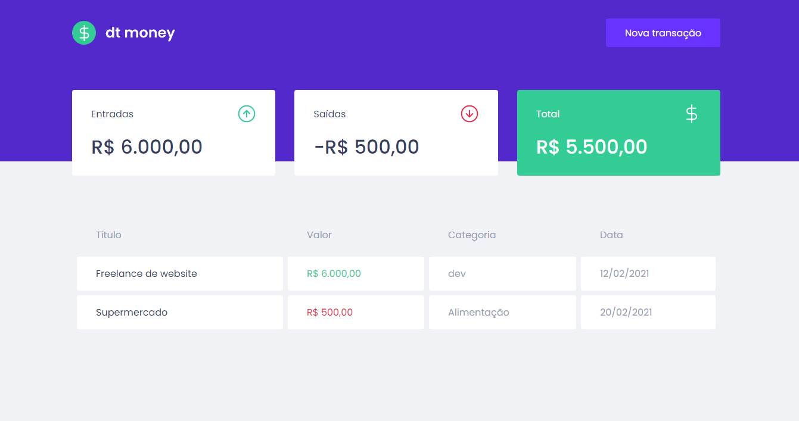

<h1 align="center">
  
</h1>

## **<h2 align="center">Front end application  💻</h2>**

## 
<h2 align="center">Financial control application developed in Ignite's second module delivered by [Rocketseat](https://app.rocketseat.com.br/dashboard)</h2> 

 

## Features
- Add a new spend or revenue
- Calculate total spending, revenue, and total summed
- List expenses or revenues

## 🚀 Technologies used:

 

## 💻 Application installation
- `https://github.com/FilipeRK/Ignite-ChapterII-dtmoney.git` to clone the repository

 

# Run application
To run the application on the web, follow the instructions from your terminal:
- `cd Ignite-ChapterII-dtmoney` and `code .`
- run `yarn` to install the dependencies of the project
- After that, run `yarn start` to run the application, will open at the address `localhost:3000`

 

# Picture of runing application

Developed by <a href="https://github.com/FilipeRK">Filipe Kohls </a>
